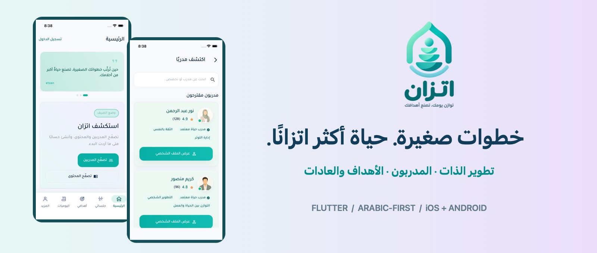
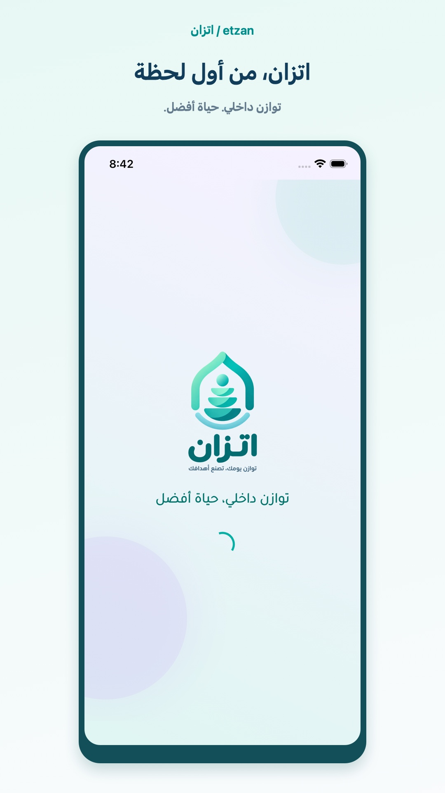
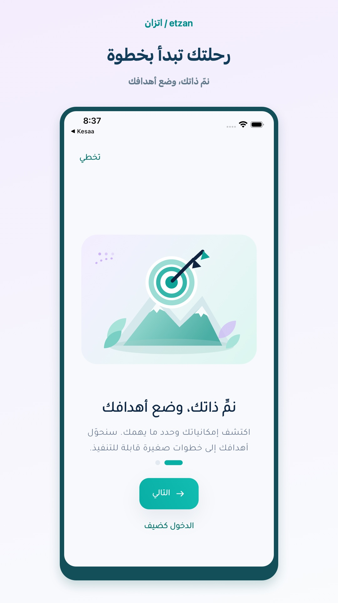
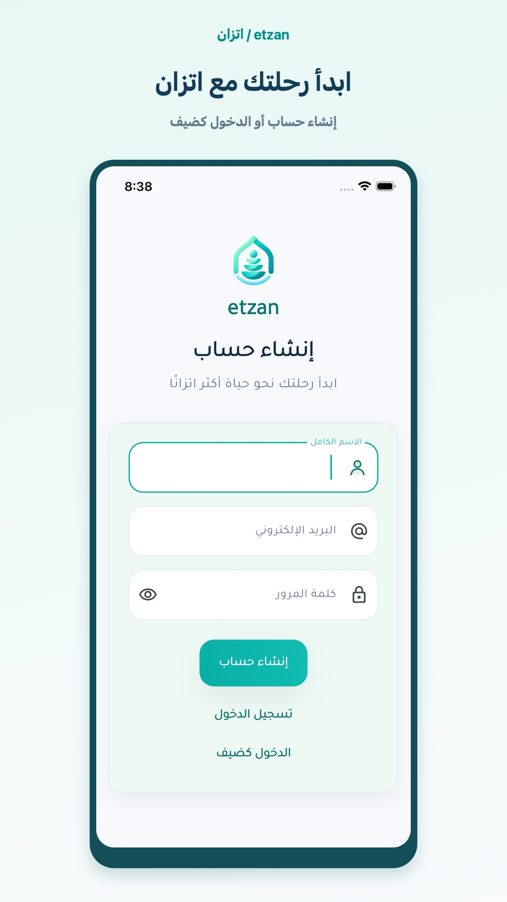
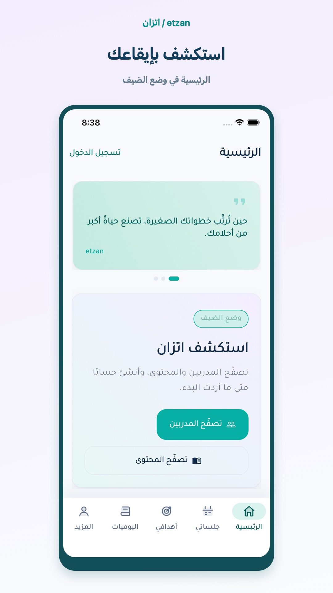
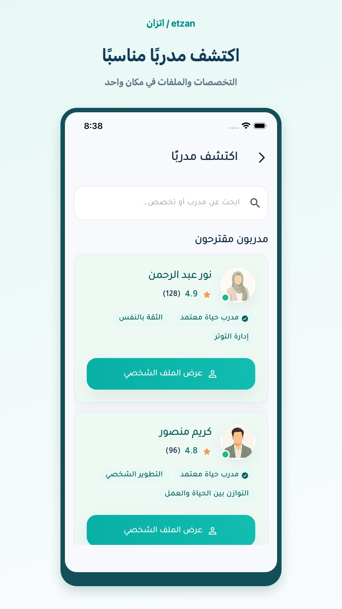
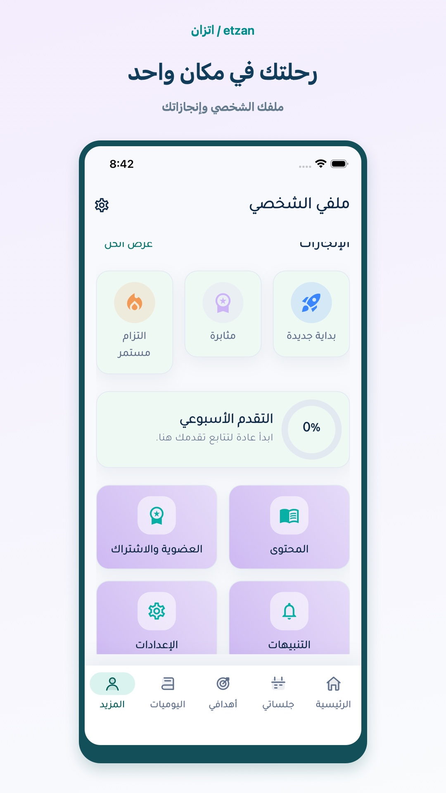
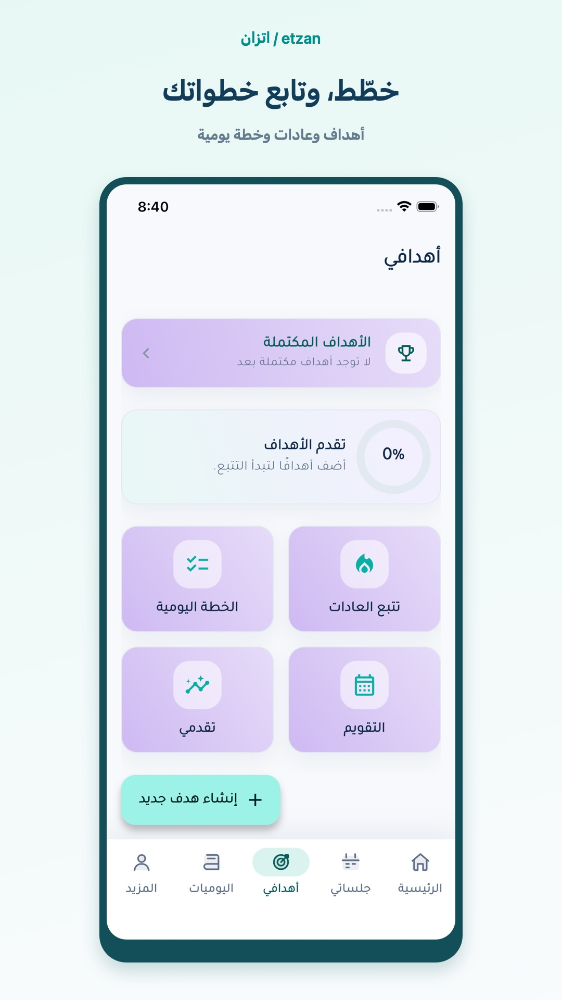
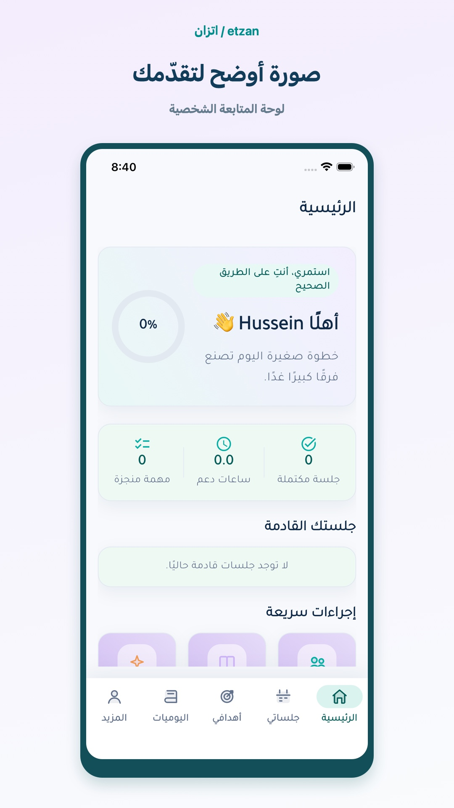

<p align="center"></p>
<h1 align="center">اتزان · etzan</h1>
<p align="center"><strong>Arabic-first life coaching & personal growth, built with Flutter.</strong></p>
<p align="center">Coaching discovery · Goals & habits · Daily planning · Journaling</p>
<p align="center">
<a href="https://husseinabozina.github.io/ettzan/">Explore the showcase</a> ·
<a href="#app-gallery">App gallery</a> ·
<a href="#engineering-highlights">Engineering</a> ·
<a href="#run-locally">Run locally</a>
</p>

---

## A calmer space for personal growth

Etzan brings coaching discovery, personal goals, habits, daily planning, and reflection into one Arabic-first mobile experience. Visitors can explore coaches and resources as guests; account-based journeys provide a personal dashboard, goals, journal, sessions, and profile.

<div dir="rtl">

**اتزان** مساحة لتطوير الذات وتنظيم خطواتك اليومية: اكتشف المدربين، ضع أهدافك، تابع عاداتك، ودوّن رحلتك. واجهة عربية بهوية بصرية موحّدة، مع دعم الإنجليزية والاتجاهين RTL/LTR.

</div>

Repository name: **`ettzan`**. App display name: **`etzan`**. Dart package: `etzan_life_coaching`.

## App gallery

Real screenshots from the iPhone 16e Simulator, presented in branded frames. Click a preview to inspect the original screen. Full screens are preserved; captions never cover application content.

<table>
  <tr>
    <td align="center" width="33%"><a href="docs/showcase/assets/screens/splash.png"></a><br><strong>Splash · البداية</strong></td>
    <td align="center" width="33%"><a href="docs/showcase/assets/screens/onboarding.png"></a><br><strong>Onboarding · التهيئة</strong></td>
    <td align="center" width="33%"><a href="docs/showcase/assets/screens/signup.png"></a><br><strong>Create account · إنشاء حساب</strong></td>
  </tr>
  <tr>
    <td align="center"><a href="docs/showcase/assets/screens/guest-home.png"></a><br><strong>Guest home · الرئيسية كضيف</strong></td>
    <td align="center"><a href="docs/showcase/assets/screens/coaches.png"></a><br><strong>Discover coaches · المدربون</strong></td>
    <td align="center"><a href="docs/showcase/assets/screens/profile.png"></a><br><strong>Profile · الملف الشخصي</strong></td>
  </tr>
  <tr>
    <td align="center"><a href="docs/showcase/assets/screens/goals.png"></a><br><strong>Goals · أهدافي</strong></td>
    <td align="center"><a href="docs/showcase/assets/screens/dashboard.png"></a><br><strong>Dashboard · لوحة المتابعة</strong></td>
    <td align="center"><strong>Explore every detail</strong><br><br><a href="https://husseinabozina.github.io/ettzan/">Open the interactive showcase</a><br>Filter screens and open full-size captures.</td>
  </tr>
</table>

The account capture is **Create account**, not Login. A dedicated Login capture is not included yet. Screenshots document the interface at capture time; names, ratings, and progress indicators are not product-performance claims.

## Product journeys

| Area | What the project includes |
| --- | --- |
| First-time experience | Splash, two onboarding steps, signup/login, password-reset and Google sign-in integration code |
| Guest access | Guest dashboard, coach/resource discovery, account-required route handling |
| Coaching | Coach search and profiles, booking, session details, upcoming sessions, chat |
| Personal growth | Goals and milestones, completed goals, habits, daily plan, calendar |
| Reflection | Journal entries and mood selection, progress analytics |
| Account | Profile, achievements, weekly progress, resources, notifications, settings |
| Presentation | Arabic/English localization, RTL/LTR, light/dark themes, responsive shared layouts |

## Engineering highlights

- **Feature-first structure:** presentation, domain, and data layers in Auth, Dashboard, and Notifications; shared backend operations also live in `core/data/etzan_backend_repository.dart`.
- **State management:** Flutter Bloc / Cubit for authentication, dashboard, and notifications.
- **Dependency injection:** GetIt wires repository contracts, data sources, use cases, and Cubits.
- **Data boundaries:** DTOs and mappers translate API fields into domain entities in layered slices.
- **Supabase integration code:** authentication, data queries/mutations, Storage, and realtime messages/notifications. Availability depends on the configured backend and its policies.
- **Design system:** reusable components and centralized colors, typography, spacing, radii, and breakpoints.
- **Adaptive presentation:** constrained content widths, responsive grids, phone bottom navigation and larger-screen navigation; Arabic/English direction handling.
- **Test sources:** mapper, widget, and application smoke tests are included under `test/`. This is not a claim that every test or journey has passed on every platform.

### Stack

| Purpose | Technology |
| --- | --- |
| Application | Flutter · Dart |
| State & equality | flutter_bloc · equatable |
| Dependency injection | get_it |
| Backend client | supabase_flutter |
| Localization | easy_localization · flutter_localizations |
| Visuals & media | flutter_svg · google_fonts · image_picker |
| In-app resources | webview_flutter |

### Structure

```text
lib/
├── app/                 # Bootstrap, routing, settings
├── core/
│   ├── config/          # Runtime environment
│   ├── data/            # Shared backend repository
│   ├── design_system/   # Visual tokens
│   ├── di/              # Dependency injection
│   ├── localization/    # Languages and translations
│   ├── navigation/      # Routes and adaptive navigation
│   ├── responsive/      # Breakpoints and content constraints
│   └── widgets/         # Reusable components
└── features/
    ├── auth/
    ├── dashboard/
    ├── coaching/
    ├── growth/
    ├── journal/
    ├── notifications/
    └── account/

docs/showcase/           # Independent static portfolio website
supabase/                # Backend notes and supporting SQL
test/                    # Mapper, widget, and smoke-test sources
```

## Run locally

Use a Flutter SDK compatible with the pinned dependencies. Dart constraint: **>=3.6.0 <4.0.0**. Flutter **3.38.5 / Dart 3.10.4** was used during local preparation. Android and iOS platform directories are already included.

```bash
git clone https://github.com/Husseinabozina/ettzan.git
cd ettzan
flutter pub get
flutter run \
  --dart-define=SUPABASE_URL=YOUR_SUPABASE_URL \
  --dart-define=SUPABASE_PUBLISHABLE_KEY=YOUR_PUBLISHABLE_KEY
```

For OAuth/deep-link configuration, also set `SUPABASE_AUTH_REDIRECT_URL` as needed. See [backend setup notes](supabase/README.md) and [environment configuration](lib/core/config/app_environment.dart). The repository contains client publishable defaults; configure your own backend for an independent deployment. Never put service-role keys in a mobile client.

Account-based features need the expected tables, RPCs, storage buckets, and authorization policies. Included SQL files are supporting scripts, **not a complete reproducible database migration**.

```bash
flutter test
```

## Scope & current boundaries

- This is a life-coaching / personal-development portfolio project, not a claim of a licensed clinical treatment service.
- Subscription screens and plans are present; payment-provider integration is pending.
- The website is a static showcase, **not** a browser build of the Flutter app, and does not collect account details.
- No downloadable APK or published-store link is supplied in this showcase yet.
- This showcase revision changes documentation, images, and website assets; it does not re-test or alter the mobile app.

## Project documentation

[Architecture](docs/ARCHITECTURE.md) · [Design system](docs/DESIGN_SYSTEM.md) · [Localization & structure](docs/LOCALIZATION_AND_STRUCTURE_AR.md) · [API contracts](docs/API_CONTRACTS.md) · [Backend notes](supabase/README.md) · [Asset provenance](docs/showcase/assets/PROVENANCE.md)

Earlier design reference boards remain in `design_reference/`; the gallery uses actual app screenshots.

## Showcase website

The site lives in **this same repository**, under `docs/showcase/`. `.github/workflows/showcase-pages.yml` publishes only that directory to GitHub Pages on updates to `main`. No Flutter build or dependency installation is part of website deployment.

```bash
python3 -m http.server 4174 --directory docs/showcase
```

Open `http://localhost:4174`. On macOS, regenerate the poster exports with:

```bash
swift tools/generate-showcase.swift
```

Built by [Hussein Abozina](https://github.com/Husseinabozina).
